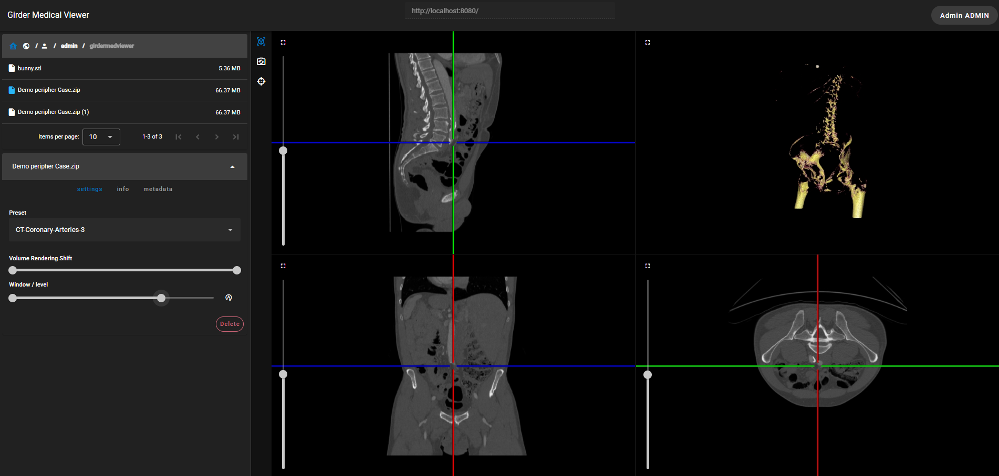

# GirderMedViewer

GirderMedViewer is a medical visualization tool built with VTK and trame,
integrated with a Girder database via the
[Girder Web Components](https://github.com/Kitware/trame-gwc).

Its goal is to enable users to visualize medical data stored in Girder directly,
without requiring local downloads. One can access any publicly available Girder
instance by entering its URL (e.g. https://data.kitware.com/).



## Create environment and install dependencies

```
python -m venv .venv
source .venv/bin/activate
pip install -e ".[dev]"

# Optional: to support loading dicom archives
pip install -e ".[dicom]"
```

## TurboJPEG optional dependency

Faster Jpeg encoding using TurboJPEG.

**macOS system install**

```
brew install jpeg-turbo
```

**Windows install**

Download and install from GitHub:
https://github.com/libjpeg-turbo/libjpeg-turbo/releases

**Linux install**

```
# RHEL/CentOS/Fedora
# YUM doc: https://libjpeg-turbo.org/Downloads/YUM

# Ubuntu
apt-get install libturbojpeg
```

### For libjpeg-turbo version 3.x:

```
source .venv/bin/activate
pip install PyTurboJPEG
```

### For libjpeg-turbo version 2.x:

```
source .venv/bin/activate
pip install PyTurboJPEG==1.8.3
```

## Setup configuration

To configure the application, create an `app.cfg` file based on the provided
[app.template.cfg](./app.template.cfg). This configuration file allows you to:

- **UI Settings**: Customize the application title displayed in the toolbar.
- **Logging Configuration**: Define the logging level (e.g., `INFO` or `DEBUG`).
- **File Download Management**: Set up temporary storage for downloaded files.
- **Girder Connection**: Configure the API root and default connection settings.

By default, a standard Girder configuration is expected, but you can specify
additional settings for predefined URLs if needed.

## Girder

To use the application, you need access to at least one Girder instance. You can
either create an account on
[https://data.kitware.com/](https://data.kitware.com/) (the default server in
the configuration file) or use your own Girder instance. If you prefer to deploy
your own Girder server, you can follow
[these instructions](https://girder.readthedocs.io/en/latest/) or run it locally
with the following commands:

```
pip install girder
girder build
girder serve
```

## Run trame application

```
girdermedviewer-cli
```

You can add `--server` to your command line to prevent your browser from opening
and `--port` to specify the port the server should listen to, default is 8080.

## Deploy Girder plugin to avoid download

You can add the [GirderMedViewer Plugin](./utils/girdermedviewer_plugin) to your
Girder to allow the Trame app to access the paths of the Girder files stored in
assetstores. Therefore the Girder files do not need to be downloaded and can be
read directly from the Girder assetstores whose paths have been specified in the
configuration file (`app.cfg`).

Follow the [plugin README](./utils/girdermedviewer_plugin/README.md) to install
it.

## Deploy without launcher

```
python -m trame.tools.serve --exec girdermedviewer.app.core:MyTrameApp
```

This is not for production. It creates a unique process for multiple users.

## Deploy with wslink launcher

Create empty file "proxy-mapping.txt" and empty folder "logs". Update
examples/launcher/launcher.json and index.html to fix paths.

Start launcher:

```
python -m wslink.launcher .\examples\launcher\launcher.json --debug
```

Open launcher page at "localhost:9999"
